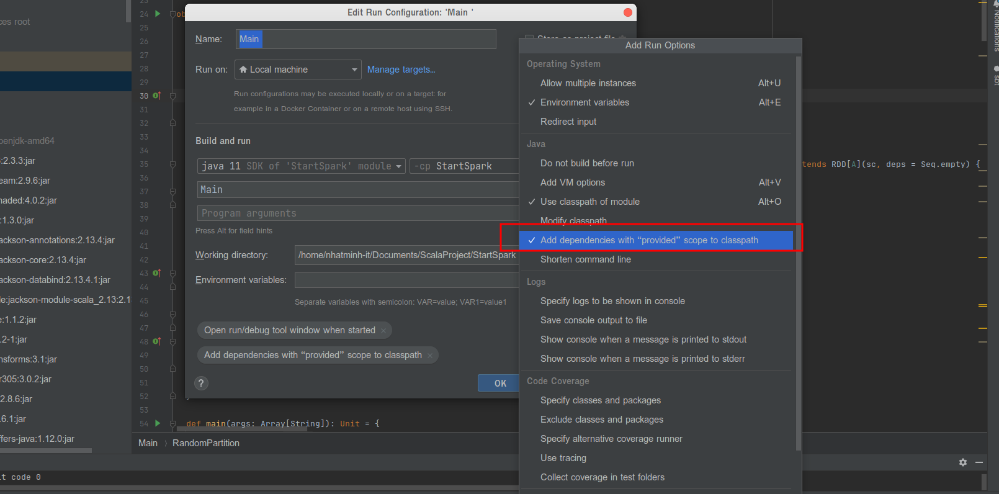

# start-spark

## Set up
- Using:
  - SDK 11
  - Scala 2.13
  - Sbt 1.8
- Run:
  - Change path file in line 74 to your path file
  - Uncomment line 57 if you want to run Argument A, 58 if you want to run Argument B
  - Build and Run Main.scala (Note: If you are running from IntelliJ, please check for "Include dependencies with Provided scope" as follows - Inside Run/Debug Configuration please select for Modify Options and then mark checked "Include dependencies with Provided scope"
)

## Struct of Main.scala
- Main function
  - Argument A
    - Argument A.1
    - Argument A.2
    - Argument A.3
    - Argument A.4&5
    - Argument A.6
  - Argument B
    - Sample data generated by struct [here](https://drive.google.com/file/d/17J0SPRBwPpR1TSbSkTtAVFsPDxhzhFYW/view?usp=share_link)